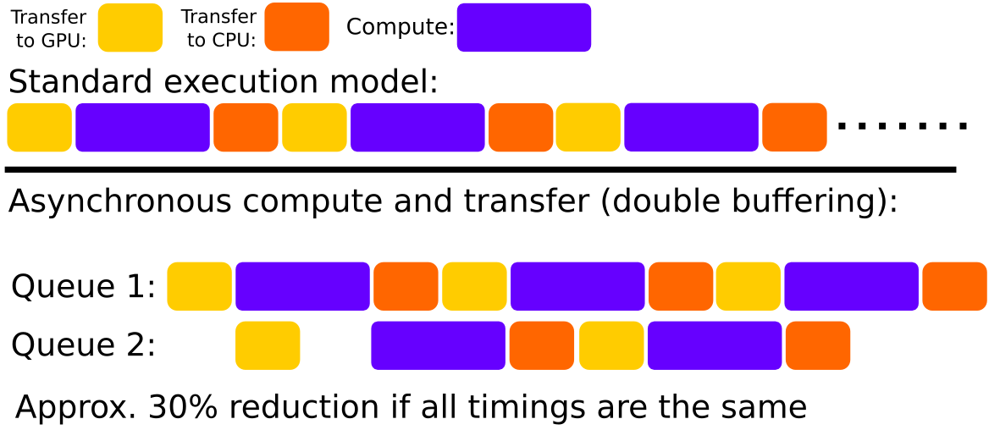

# Summary

Quantitative MR imaging (qMRI) and the associated possibility of finding imaging biomarkers has gained considerably in importance with the development towards stratified and quantitative medicine. qMRI aims to identify the underlying bio-physical and tissue parameters that determine contrast in an imaging experiment. In addition to the contrast information from conventional MRI examinations, qMRI provides insights into diseases based on biophysical, microstructural, and also functional information in absolute quantitative values. For quantification, biophysical models are used, which describe the relationship between image intensity and physical properties of the tissue for certain scanning sequences and sequence parameters. By performing several measurements with different sequence parameters (e.g. flip angle, repetition time, echo time) the related inverse problem of identifying the tissue parameters sought can be solved.

Quantitative MR typically suffers from an increased measurement time due to repeated imaging experiments. Therefore, methods to reduce scanning time by means of optimal scanning protocols and subsampled data acquisition have been extensively studied but these approaches are typically associated with a reduced SNR and can suffers from subsampling artifacts in the images. To address both aspects, it has been shown that the inclusion of the biophysical model in the reconstruction process leads to a much faster data acquisition while simultaneously improving image quality. The inverse problem associated with this special reconstruction approach requires dedicated numerical solution strategies [@Donoho2006; @Lustig2007; @Block2009; @Doneva2010; @Sumpf2012; @Roeloffs2016; @Maier2019c], commonly known as model-based reconstruction. Model-based reconstruction is based on variational modeling and combines parallel imaging and compressed sensing to achieve very high acceleration factors above ten compared to fully sampled acquisitions. The method directly solves for the unknown parameter maps from raw k-space data. The repeated transition from k-space to image-space combined with the involved non-linear iterative reconstruction techniques to identify the unknown parameters often leads to prolonged reconstruction times. An effect that gets even more demanding if 3D image volumes are of interest. 

In recent years the upsurge of computationally powerful GPUs has led to a variety of GPU based implementations to speed up computation time of highly parallelizeable operations 
(e.g., the Fourier transformation in MRI [@Knoll2014g]). As model-based approaches possibly deal with hundred Gigabytes of data (e.g. diffusion tensor imaging), available memory on current GPUs (e.g. 12 GB) can be a limiting factor. Thus, most reconstruction and fitting algorithms are applied in a slice-by-slice fashion to the volumetric data by taking a Fourier transformation along a fully sampled acquisition direction, effectively yielding a set of 2D problems. Hence the additional information in form of the third dimension of volumetric data is neglected, leading to a loss in performance.

To utilize full 3D information in advanced reconstruction and fitting algorithms on memory limited GPUs, 
special solutions strategies are necessary to leverage the speed advantage, e.g., hide memory latency of repeated transfers to/from the GPU to host memory.
This can be achieved using asynchronous execution strategies but correct synchronization of critical operations can be error prone.
To this end, we propose `PyQMRI`, a simple to use python toolbox for quantitative MRI.

# Statement of need 

`PyQMRI` aims at reducing the required reconstruction time by means of a
highly parallelized `PyOpenCL` [@Klockner2012a] implementation of a state-of-the-art model-based reconstruction and fitting algorithm 
while maintaining the easy-to-use properties of a Python package.
In addition to processing small data (e.g. 2D slices) completely on the GPU an efficient
double-buffering based solution strategy is implemented. Double-buffering 
allows to overlap computation and memory transfer from/to the GPU, thus
hiding the associated memory latency. By overlapping the transfered blocks
it is possible to pass on 3D information utilizing finite differences based
regularization strategies [@Maier2019d]. \autoref{fig:db} shows a schematic of the employed double-buffering scheme.
To make sure that this asynchronous execution strategy yields the expected results unit-testing is emplyed.

Currently 3D acquisitions with at least one fully sampled dimension can
be reconstructed on the GPU, including stack-of-X acquisitions or 3D Cartesian
based imaging. Of course 2D data can be reconstructed as well. The combination of reconstruction and non-linear fitting is based
on an iteratively regularized Gauss-Newton (IRGN) approach combined with 
a primal-dual inner loop. Regularization strategies include total variation (TV) [@Rudin1992]
and total generalized variation (TGV) [@Bredies2010; @Knoll2011] using finite differences gradient operations. 
In addition to the combined reconstruction and fitting algorithm from k-space data, `PyQMRI` can also be used to speed-up non-linear parameter fitting
of complex or real valued image data. The main advantage of fitting the complex (k-space) data is that the assumed Gaussian noise characteristics for the commonly used $L_2$ data fidelity term are valid. This is especially important for problems suffering from poor SNR, e.g. Diffusion Tensor Imaging, where the wrong noise assumption can lead to significant errors in the quantification process [@Jones2004].

`PyQMRI` comes with several pre-implemented quantiative models. In addition,
new models can be introduced via a simple text file, utilizing the power
of `SymPy` to generate numerical models as well as their partial derivatives in Python. Fitting can be initiated via a command line interface (CLI) or by importing the package
into a Python script. To the best of the authors knowledge `PyQMRI`
is the only available Python toolbox that offers real 3D regularization 
in an iterative solver for inverse quantitative MRI problems
and for arbitrary large volumetric data while simultaneously utilizing the computation
power of recent GPUs. Due to `PyQMRI`s OpenCL backend no vendor specific hardware restrictions are present, however,
current limitations of the `gpyfft` package used to wrap the `clfft`, constrain the use to GPU devices only.
A switch to other `clfft` wrappers might solve this limitation in future releases but `gpyfft` is the only one that currently supports fast non-power-of-two transformations up to 13.

`PyQMRI` and its predecessors have been succesfully used in several scientific
publications. Examples include $T_1$ quantification from subsampled radial FLASH 
and inversion-recovery Look-Locker data [@Maier2019c], diffusion tensor imaging [@Maier2020a], 
and ongoing work on aterial spin labeling [@Maier2020b; @Maier2020c], as well as low-field $T_1$ mapping at multiple fields using fast field-cycling MRI. 

# Algorithmic
`PyQMRI` deals with the following general problem structure:

$$
\underset{u,v}{\min}\quad 
\frac{1}{2}\|A(u) - d\|_2^2 
+\nonumber \gamma( \alpha_0\|\nabla u - v\|_{1,2,F} + 
\alpha_1\|\mathcal{E}v\|_{1,2,F})
$$
which includes a non-linear forward operator ($A$), mapping the parameters $u$ to (complex) data space $d$, and a non-smooth regularization functional due to 
the $L^1$-norms of the T(G)V functional [@Bredies2010; @Knoll2011]. Setting $\alpha_1=0$ and $v=0$ the problem
becomes simple TV regularization [@Rudin1992]. The gradient&nbsp;$\nabla$ and symmetrized gradient&nbsp;$\mathcal{E}$ operators are implemented using finite differences.
To further improve the quality of the reconstructed parameter maps `PyQMRI` uses a Frobenius norm to join spatial
information from all maps in the T(G)V functionals [@Bredies2014; @Knoll2017a]. Box constraints, limiting each unknown parameter in $u$ to a physiological meaningful range,
can be set in conjunction with real or complex value constraints.

Following the Gauss-Newton approach a sequence $k$ of linearized sub-problems of the form
$$
\underset{u,v}{\min}\quad 
\frac{1}{2}\|\mathrm{D}A\rvert_{u=u^{k}} u-\tilde{d}^k
\|_2^2 + \nonumber\gamma_k(\alpha_0\|\nabla u - v\|_{1,2,F} + \alpha_1|\|\mathcal{E}v\|_{1,2,F}) +
\nonumber \frac{\delta_k}{2}\|u-u^k\|_{M_k}^2.
$$
needs to be solved to find a solution of the overall problem. The matrix $\mathrm{D}A
\rvert_{u=u^{k}} = \frac{\partial{A}}{\partial 
u}(u^k)$ resembles the Jacobian of the system. The subproblems can be recast into a saddle-point structure by application of the Fenchel duality
\begin{equation}\label{eq:PD}
\underset{u}{\min}\,\underset{y}{\max}~ \left<\mathrm{K}u,y\right> + G(u) - 
F^*(y),
\end{equation}
and solved utilizing a well established primal-dual algorithm [@Chambolle2011]
 combined with a line-search [@Malitsky2018] to speed-up convergence. Constant terms, stemming from the linearization, are precomputed and fused with the data $d$, yielding $\tilde{d}^k$.
The inclusion of the additional $L^2$-norm penalty improves convexity of the subproblem and resembles a Levenberg-Marquat update for $M_k=diag(\mathrm{D}A\rvert_{u=u^{k}}^T
\mathrm{D}A\rvert_{u=u^{k}})$. A graphical representation of the involved steps is given in \autoref{fig:pipeline}. The regularization weights, regularization type (TV/TGV), and the number of outer and inner iterations can be changed using a plain text configuration file. It was shown by [@Salzo2012] that the GN approach converges with linear rate to a 
critical point for non-convex problems with non-differential penalty functions if the initialization is sufficiently close. Thus a meaningful initial guess based on physiological knowledge on the parameters $u$ should be used to initialize the fitting, e.g. mean $T_1$ value of the tissue of interest.

# Acknowledgements

Oliver Maier acknowledges grant support from the Austrian Academy of Sciences under award DOC-Fellowship 24966.

The authors would like to acknowledge the NVIDIA Corporation Hardware grant support.

# References
