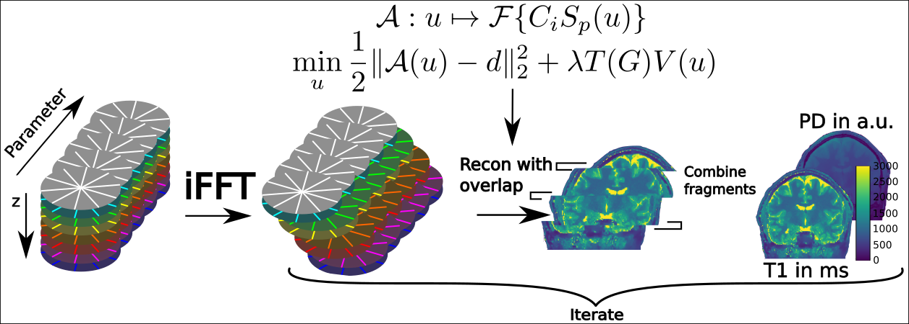

# Summary

Quantitative MRI (qMRI) aims at identifying the underlying physical tissue constants 
that define the contrast in an imaging experiment. Under certain simplifications,
analytical expressions are available to describe the relation between image
intensity and physical parameters of tissue. Using several measurements with 
varying sequence parameters it is possible to solve the associated inverse problem
of identifying the tissue constants.

The increased measurement time due to the repeated imaging experiments of such studies is typically tackeld by 
undersampling the data acquisiton. However, the reduced amount of data as well 
as the typical non-linear structure of the associated inverse problem require dedicated numerical solution strategies [@Donoho2006; @Lustig2007; @Block2009; @Doneva2010; @Sumpf2012; @Roeloffs2016]
which lead to prolonged reconstruction times. An effect that gets even worse if 3D volumes are of interest. 

In recent years the upsurge of computationally powerful GPUs has led to a variety of
GPU based implementations to speed up computation time of highly parallelizeable operations 
(e.g., the Fourier transformation in MRI [@Knoll2014g]). However, as memory is
a scarce resource, most of the work is carried out in a 2D fashion, even though
additional information in form of a third dimension is commonly available.

To utilize 3D information on memory limited GPUs special solutions strategies are 
necessary to maintain the speed advantage, e.g., hide memory latency of repeated transfers.

# Statement of need 

'PyQMRI' aims at reducing the required reconstruction time by means of a
highly parallelized PyOpenCL [@Klockner2012a] implementation of an state-of-the-art fitting algorithm 
while maintaining the easy-to-use properties of a Python package.
In addition to fitting small date (e.g. 2D slices) completely on the GPU an efficient
double-buffering based solution strategy is implemented. Double-buffering 
allows to overlap computation and memory transfer from/to the GPU, thus
hiding the associated memory latency. By overlapping the transfered blocks
it is possible to pass on 3D information utilizing finite differences based
regularization strategies [@Maier2019d]. Figure \autoref{fig:db} shows a schematic of the employed double-buffering scheme.

Currently 3D acuqisitions with at least one fully sampled dimension can
be reconstructed on the GPU, including stack-of-X acquisitions or 3D Cartesian
based imaging. Of course 2D data can be reconstructed as well. Fitting is based
on an iterativly regularized Gauss-Newton (IRGN) approach combined with 
a primal-dual inner loop. Regulariaztion strategies include total variation (TV)
and total generalized variation (TGV) using finite differences gradient operations.

'PyQMRI' comes with several pre-implemented quantiative models. In addition
new models can be introduced via a simple text file, utilizing the power
of 'SymPy'. Fitting can be initiated via a CLI or by importing the package
into a Python script. To the best of the authors knowledge 'PyQMRI'
is the only availabel Python toolbox that offers real 3D regularization 
in an iterative solution algorithm for inverse quantitative MRI problems
and for arbitrary large volumetric data while simultaneously utilizing the computation
power of recent GPUs.

'PyQMRI' and its precedors have been succesfully used in several scientific
publications. Examples include T1 quantification from subsampled radial FLASH 
and inversion-recovery Look-Locker data [@Maier2019c], diffusion tensor imaging [@Maier2020a], 
and on-going work on aterial spin labeling [@Maier2020b; @Maier2020c], as well as low-field T1 mapping using field cycling MRI. 

# Algorithmic
The general problem structure dealt with in 'PyQMRI' is as follows:

$$
\underset{u,v}{\min}\quad 
\frac{1}{2}\sum_{n=1}^{N_d}\|A_{\phi,t_n}(u)-d_n\|_2^2 
+\nonumber \gamma( \alpha_0\|\nabla u - v\|_{1,2,F} + 
\alpha_1\|\mathcal{E}v\|_{1,2,F})
$$
which includes a non-linear forward operator ($A$), mapping the parameters $u$ to (complex) data space $d$, and non-smooth regularization due to 
the $L^1$-norms of the T(G)V functional [@Bredies2010; @Knoll2011]. Setting $\alpha_1=0$ and $v=0$ the problem
becomes simple TV regularization [@Rudin1992]. The gradient $\nabla$ and symmetrized gradient $\mathcal{E}$ operators are implemented using finite differences.
To further improve the quality of the reconstructed parameter maps 'PyQMRI' uses a Frobenius norm to join spatial
information from all maps in the T(G)V functionals [@Bredies2014; @Knoll2017a].

Following the Gauss-Newton approach a sequence $k$ of linearized sub-problems of the form
$$
\underset{u,v}{\min}\quad 
\frac{1}{2}\sum_{n=1}^{N_d}\|\mathrm{D}A_{\phi,t_n}\rvert_{u=u^{k}} u-\tilde{d_n}^k
\|_2^2 + \nonumber\gamma_k(\alpha_0\|\nabla u - v\|_{1,2,F} + \alpha_1|\|\mathcal{E}v\|_{1,2,F}) +
\nonumber \frac{\delta_k}{2}\|u-u^k\|_{M_k}^2.
$$
needs to be solved to find a solution of the overall problem. The solution if this subproblems is realized by utilizing a well established primal-dual algorithm [@Chambolle2011]. 
The inclusion of the additional $L^2$-norm penalty improves convexity of the subproblem and resembles a Levenberg-Marquat update for proper choices of the weighting matrix $M$.
A graphical representation of the involved steps is given in figure \autoref{fig:pipeline}.

# Acknowledgements

Oliver Maier acknowledges grant support from the Austrian Academy of Sciences under award DOC-Fellowship 24966.

# References
